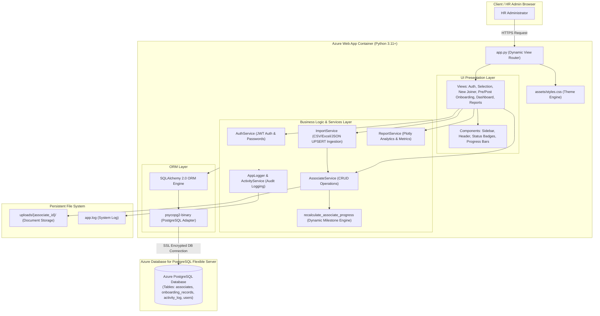

# Project Architecture - Onboarding Operations

This document provides a comprehensive technical architecture overview of the **Onboarding Operations System**, designed for production deployment on **Azure Web App (Linux App Service)** with **Azure Database for PostgreSQL Flexible Server**.

---

## 1. System Architecture Block Diagram

```
+-----------------------------------------------------------------------------------+
|                                 USER / HR ADMIN                                   |
|                        (Browser Interface via HTTPS / SSL)                         |
+-----------------------------------------------------------------------------------+
                                         |
                                         v
+-----------------------------------------------------------------------------------+
|                            AZURE WEB APP (App Service)                            |
|                            Linux Container (Python 3.11+)                         |
|                                                                                   |
|  +-----------------------------------------------------------------------------+  |
|  |                           STREAMLIT PRESENTATION LAYER                      |  |
|  |  - app.py (Entry point & Dynamic Router)                                    |  |
|  |  - Theme & Styling Engine (assets/styles.css & .streamlit/config.toml)       |  |
|  |  - Reusable UI Components (components/ sidebar, cards, tables, badges, etc.)|  |
|  |  - Page Views (views/ auth, onboarding, pre/post, reports, dashboard, etc.)  |  |
|  +-----------------------------------------------------------------------------+  |
|                                        |                                          |
|                                        v                                          |
|  +-----------------------------------------------------------------------------+  |
|  |                              SECURITY & AUTH LAYER                          |  |
|  |  - JWT Authentication Token Manager (services/auth_service.py)               |  |
|  |  - Password Hashing & Secret Verification                                   |  |
|  |  - Streamlit Session State Guard                                            |  |
|  +-----------------------------------------------------------------------------+  |
|                                        |                                          |
|                                        v                                          |
|  +-----------------------------------------------------------------------------+  |
|  |                              BUSINESS SERVICE LAYER                         |  |
|  |  - AssociateService: Profile CRUD & Search Filters                          |  |
|  |  - ImportService: Multi-format Parser (CSV, XLSX, JSON) & UPSERT Engine     |  |
|  |  - Progress Engine: Dynamic 14-Milestone Stage & Percentage Calculator       |  |
|  |  - ReportService: Department Analytics & Upcoming Joiners Metrics           |  |
|  |  - ActivityService & AppLogger: Centralized Audit Logging System            |  |
|  +-----------------------------------------------------------------------------+  |
|                                        |                                          |
|                                        v                                          |
|  +-----------------------------------------------------------------------------+  |
|  |                           ORM & DATABASE ENGINE                             |  |
|  |  - SQLAlchemy 2.0 ORM Declarative Models (models.py)                        |  |
|  |  - Connection Pooling & Connection Ping (database.py)                       |  |
|  |  - Driver: psycopg2-binary                                                  |  |
|  +-----------------------------------------------------------------------------+  |
+----------------------------------------|------------------------------------------+
                                         |
                                         | Connection String / SSL Mode (require)
                                         v
+-----------------------------------------------------------------------------------+
|                   AZURE DATABASE FOR POSTGRESQL FLEXIBLE SERVER                   |
|                                                                                   |
|  Tables:                                                                          |
|    - associates: Personal, employment, location, & work mode details             |
|    - onboarding_records: 14-item milestone checklist, stage, and progress %    |
|    - activity_log: Audit trail of system events & milestone transitions          |
|    - users: HR Admins & system credentials with JWT tokens                        |
+-----------------------------------------------------------------------------------+
                                         |
                                         v
+-----------------------------------------------------------------------------------+
|                              PERSISTENT FILE STORAGE                              |
|  - uploads/{associate_id}/: Storage for associate document attachments             |
|  - app.log: Physical rotating application log file                                |
+-----------------------------------------------------------------------------------+
```

---

## 2. Interactive Architecture Flow (Mermaid Format)



---

## 3. Core Technical Layer Specifications

### 1. Presentation Layer (Streamlit & Custom CSS)
- **Framework**: Streamlit `1.30+` configured for wide-layout single-page responsive navigation.
- **Styling**: `assets/styles.css` delivers custom color palettes, glassmorphism card elevation, status pill badges, and clean typography.
- **Routing**: Query parameter driven and `st.session_state` view switching across 11 focused page modules.

### 2. Security & Authentication Layer
- **Authentication**: JWT (JSON Web Token) encoding for password credential validation (`PyJWT`).
- **User Roles**: Pre-seeded Super Admin (`admin@company.com`) and HR Manager roles.
- **Guard Mechanism**: Streamlit session state check (`st.session_state['authenticated']`) halts non-authenticated request execution at `app.py`.

### 3. Business Service Layer
- **Associate Service**: Manages candidate profile creation, automatic employee ID generation (`EMP-2026-XXX`), full-text search, and multi-parameter filtering.
- **Import Service**: Parses bulk data files (Excel `.xlsx`, `.xls`, `.csv`, `.json`), maps up to 71 HR system columns, and executes UPSERT updates on match.
- **Dynamic Progress Engine**: Computes exact overall completion percentage based on a strict 14-item milestone checklist spanning Pre-Onboarding (6 items), Onboarding Day (4 items), and Post-Onboarding (4 items).

### 4. ORM & Database Layer
- **ORM Engine**: SQLAlchemy 2.0 mapping declarative models to PostgreSQL schemas.
- **Connection Management**: Scoped sessions with `pool_pre_ping=True`, `pool_size=10`, `max_overflow=20` for Azure PostgreSQL cloud stability.
- **Database Server**: Azure Database for PostgreSQL Flexible Server configured with SSL (`sslmode=require`).

---

## 4. Key Directory Structure

```
HR- On Boarding/
├── app.py                      # Main entrypoint & view router
├── config.py                   # Environment & Azure PostgreSQL configuration
├── database.py                 # Azure PostgreSQL session & seeding engine
├── models.py                   # SQLAlchemy ORM model definitions
├── requirements.txt            # Python production dependencies
├── README.md                   # Production setup & deployment documentation
├── project_info/               # Project architecture & workflow documentation
│   ├── architecture.md         # System architecture block diagrams & specs
│   └── workflow.md             # End-to-end user workflow block diagrams
├── components/                 # Reusable Streamlit UI components
├── views/                      # Application view modules
├── services/                   # Business logic & service repositories
├── utils/                      # Helper utilities & logging engines
├── assets/                     # CSS stylesheets & logo branding
├── uploads/                    # Associate document attachments
└── tests/                      # Pytest unit testing suite
```
