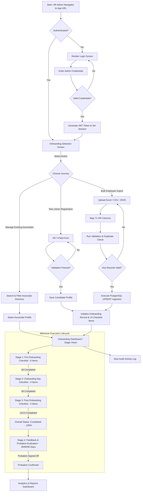

# End-to-End User Workflow - Onboarding Operations

This document describes the complete operational workflow of the **Onboarding Operations System**, mapping out the journey of an HR Administrator from initial access through associate registration, milestone progression, 90-day post-onboarding tracking, and analytics reporting.

---

## 1. End-to-End Operational Workflow Diagram (Block Diagram)

```
+-----------------------------------------------------------------------------------+
|                                 1. USER ARRIVAL                                   |
|       HR Admin accesses the web application URL (Azure Web App HTTPS endpoint)   |
+-----------------------------------------------------------------------------------+
                                         |
                                         v
+-----------------------------------------------------------------------------------+
|                             2. AUTHENTICATION GUARD                               |
|   - Prompted for Admin Email & Password                                           |
|   - System verifies credentials against Azure PostgreSQL users table using JWT    |
|   - Authenticated -> Redirected to Onboarding Hub Selection                       |
+-----------------------------------------------------------------------------------+
                                         |
                                         v
+-----------------------------------------------------------------------------------+
|                         3. ONBOARDING HUB LANDING CHOICE                          |
|                                                                                   |
|         +----------------------------------+----------------------------------+   |
|         |                                  |                                  |   |
|         v                                  v                                  v   |
|  [OPTION A: SINGLE NEW JOINER]   [OPTION B: BULK FILE IMPORT]    [OPTION C: EXISTING] |
|  - Fill 7-field form             - Drag & Drop Excel/CSV/JSON    - Filter & Search    |
|  - Validate email & phone        - Map 71 HR system columns      - View progress      |
|  - Select Work Mode              - Automatic UPSERT processing   - Update milestones  |
|    (Online vs Offline)           - Batch error validation report                    |
+----------------------------------+----------------------------------+-------------+
                                   |
                                   v
+-----------------------------------------------------------------------------------+
|                        4. ASSOCIATE RECORD CREATION                               |
|   - System generates Employee ID (e.g. EMP-2026-001)                              |
|   - Initializes OnboardingRecord with 14-item milestone checklist                 |
|   - Writes initial Audit Log entry into Azure PostgreSQL                          |
+-----------------------------------------------------------------------------------+
                                         |
                                         v
+-----------------------------------------------------------------------------------+
|                          5. PRE-ONBOARDING STAGE (Stage 1)                        |
|   Checklist Items (6 Total):                                                      |
|     [x] TA Information Received                                                   |
|     [x] Connect with New Joiner                                                   |
|     [x] IT Ticket & Equipment Request (Triggers Pending Dispatch if Online)       |
|     [x] Notify Stakeholders & Reporting Manager                                   |
|     [x] Prepare Orientation Schedule                                              |
|     [x] Share Schedule with Joiner                                                |
|   Automated Action: IT equipment dispatched for virtual joiners upon completion.  |
+-----------------------------------------------------------------------------------+
                                         |
                                         v
+-----------------------------------------------------------------------------------+
|                         6. ONBOARDING DAY STAGE (Stage 2)                         |
|   Checklist Items (4 Total):                                                      |
|     [x] Day 1 Mandatory Forms (BGV, Bank Details, ISMS Declaration)               |
|     [x] Employment Documents Submission & NDA Sign-off                            |
|     [x] HR Induction & Company Orientation Walk-through                           |
|     [x] Announce Joiner on Viva Engage / Internal Channel                         |
+-----------------------------------------------------------------------------------+
                                         |
                                         v
+-----------------------------------------------------------------------------------+
|                        7. POST-ONBOARDING STAGE (Stage 3)                         |
|   Checklist Items (4 Total):                                                      |
|     [x] ID Card Request Raised                                                    |
|     [x] HRMS Document Upload & Verification (Approved status)                     |
|     [x] 1-Week Check-in Survey & Feedback                                         |
|     [x] Insurance & PF Registration Completed                                     |
|                                                                                   |
|   RESULT: 14/14 Milestones Completed -> Overall Progress = 100% (Status: Completed)|
+-----------------------------------------------------------------------------------+
                                         |
                                         v
+-----------------------------------------------------------------------------------+
|                       8. FEEDBACK & PROBATION STAGE (Stage 4)                     |
|   Checklist Items (4 Total):                                                      |
|     [x] 30-Day Manager & Associate Feedback Review                                |
|     [x] 60-Day Mid-Probation Review                                               |
|     [x] 90-Day Probation Evaluation                                               |
|     [x] Probation Completion Sign-off -> Status transitions to "Confirmed"        |
+-----------------------------------------------------------------------------------+
                                         |
                                         v
+-----------------------------------------------------------------------------------+
|                      9. ANALYTICS, REPORTING & AUDIT TRAIL                        |
|   - Executive Dashboard: Real-time Plotly charts for department distribution,     |
|     stage completion rates, and upcoming joiner metrics.                          |
|   - Audit Log: Complete historical timestamp record of all actions performed.     |
+-----------------------------------------------------------------------------------+
```

---

## 2. Interactive User Journey Flowchart (Mermaid Format)



---

## 3. Detailed Step-by-Step Workflow Descriptions

### Step 1: Authentication & Landing
- User navigates to the application host URL.
- If unauthenticated, the system displays the responsive login portal. Credentials are validated using secure JWT token verification.
- Upon successful login, the HR Admin is redirected to the **Onboarding Selection Screen**.

### Step 2: Candidate Entry (Single Registration vs Bulk Import)
- **Single New Joiner Registration**: HR Admin inputs core associate details (Name as per Aadhar, Date of Joining, Personal Email, Fresher/Last Working Day, Designation, Job Location, Work Mode, Asset Delivery Address). Validation rules ensure no numeric ID values populate name fields.
- **Bulk Employee Import**: HR Admin uploads dataset files (`.xlsx`, `.xls`, `.csv`, `.json`). The system normalizes up to 71 enterprise HR system headers, identifies duplicate records within the file, updates existing associate records via `UPSERT`, and registers new candidates seamlessly.

### Step 3: Stage 1 - Pre-Onboarding Operations (6 Milestones)
- **TA Details Verification**: Receive talent acquisition handoff documents.
- **Joiner Connection**: Reach out to candidate prior to Day 1.
- **IT Ticket & Asset Dispatch**: Raise IT equipment provisioning tickets. For virtual candidates, completing Pre-Onboarding automatically updates IT equipment status to `Dispatched`.
- **Stakeholder Notification**: Inform hiring manager, team members, and workplace facilities.
- **Schedule Preparation & Delivery**: Draft and share Day 1 orientation schedule with candidate.

### Step 4: Stage 2 - Onboarding Day Operations (4 Milestones)
- **Mandatory Forms Submission**: Ensure BGV, bank account, and ISMS compliance forms are signed.
- **Employment Documentation**: Verify NDA, offer acceptance, and educational certificates.
- **HR Induction Walk-through**: Conduct company culture, benefits, and policy orientation.
- **Welcome Announcement**: Broadcast joiner introduction on Viva Engage / internal channels.

### Step 5: Stage 3 - Post-Onboarding Activities (4 Milestones)
- **ID Card Processing**: Submit request for physical/digital security access cards.
- **HRMS Document Verification**: Review uploaded documents in `uploads/{associate_id}/` and approve status.
- **1-Week Check-in**: Collect initial 7-day feedback.
- **Insurance & PF Enrollment**: Complete statutory benefits registration.
- **Completion Milestone**: When 14 checklist items across Stages 1-3 are checked, overall progress is computed as `100.0%` and status transitions to `Completed`.

### Step 6: Stage 4 - Feedback & Probation Management
- Tracks 30-day, 60-day, and 90-day structured feedback checkpoints between manager and associate.
- Upon completing probation sign-off, associate probation status transitions from `Under Review` to `Confirmed`.

### Step 7: System Observability & Reporting
- **Executive Analytics**: Interactive Plotly visual charts display candidate counts by department, stage breakdown, work mode distribution, and overdue alert lists.
- **Audit Log**: Every milestone change, profile edit, file upload, or bulk import action is stored in the PostgreSQL `activity_log` table with exact timestamps.
